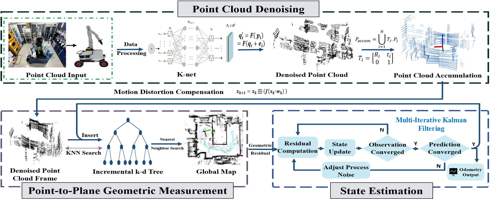
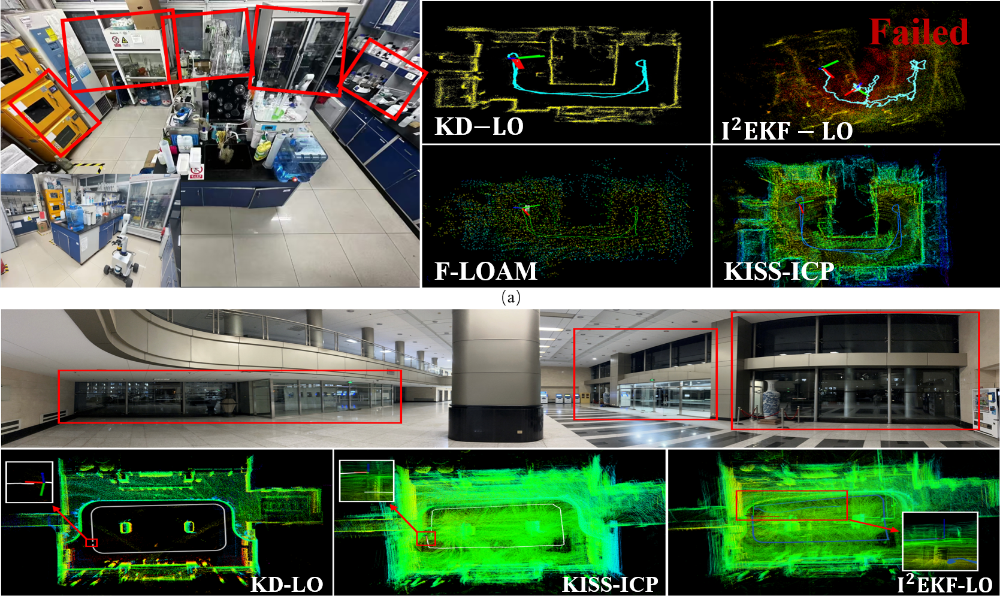

# Kolmogorov-Arnold Network-Based Denoising for LiDAR Odometry in High-Reflectivity Regions

## Overview

This project focuses on reflection and refraction-induced noise in LiDAR localization introduces false points and mismatches, disrupting feature extraction and increasing localization errors.

## Method

To achieve Precise localization in high-reflection scenarios, this work proposes an iterative optimization LiDAR odometry combined with a novel denoising network, we propose the following methods:

1. **A novel Kolmogorov-Arnold Network(KAN)-based denoising network is designed to effectively suppress reflection-induced noise in LiDAR SLAM while retaining essential structural features, ultimately enhancing localization accuracy in high-reflectivity regions.**
2. **A multi-iteration optimization framework is developed to mitigate motion distortions in real-time, integrating an adaptive approach to adjust the process noise according to the motion confidence. This significantly enhances the robustness and accuracy of state estimation.**

## Results

Our method significantly outperforms the state of the art on high-reflection scenariosg datasets:

## Code Release

Our paper has been submitted at the International Conference on Intelligent Robots and Systems (IROS). This research focuses on the problem of pure LiDAR odometry, specifically aiming to reduce point - cloud noise in high - reflectivity scenarios to improve robot localization. An innovative and highly effective denoising network has been proposed, which effectively solves the issues of failed mapping and large localization errors of robots in high - reflectivity scenarios. To promote academic exchange and development, we will open - source the project code and data as soon as possible after the relevant conference procedures are completed. We welcome you to keep an eye on this repository for the latest updates. 

KAN-Based Denoising for LiDAR Odometry in High-Reflection Environments
To implement the chemical robot localization algorithm incorporating KAN-based denoising in high-reflectivity environments, Ubuntu 20.04 was selected as the operating system, providing a stable and widely supported development environment. In terms of programming languages, C++ was primarily used for the efficient implementation of core algorithms, while Python 3.8 was employed for data processing and deep learning model training. The Robot Operating System (ROS1) was used as the communication and control framework. 
